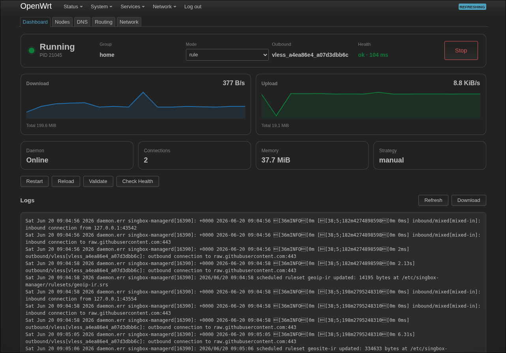
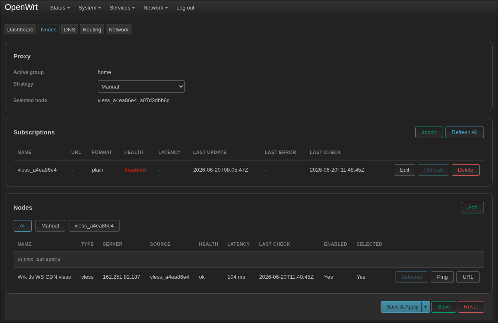
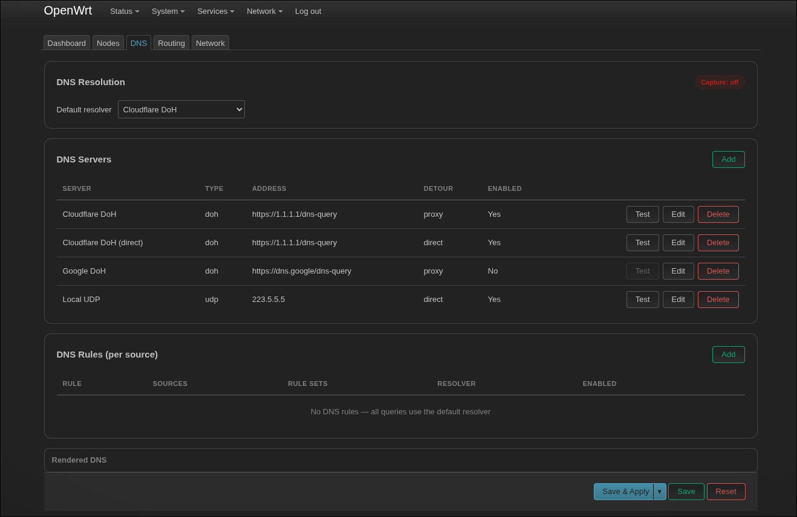
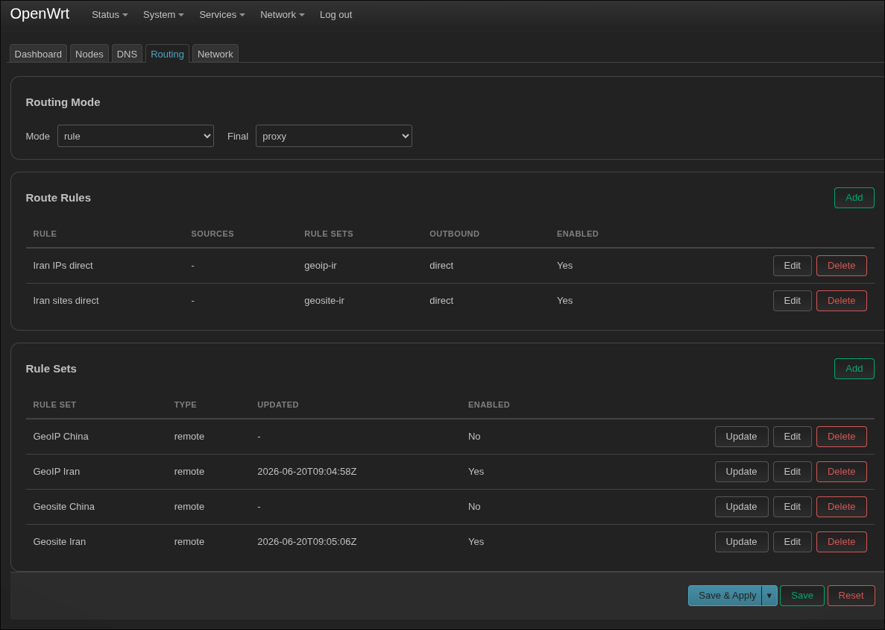
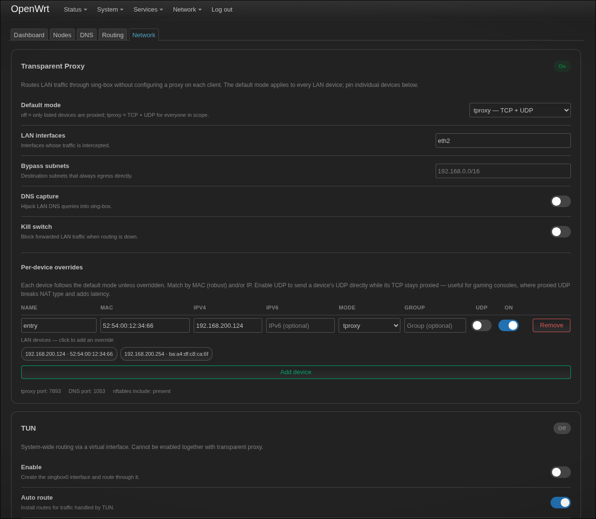

# openwrt-singbox

[](https://github.com/aminmokhtari94/openwrt-singbox/actions/workflows/ci.yml)
[](https://github.com/aminmokhtari94/openwrt-singbox/releases/latest)

An OpenWrt-native manager for [sing-box](https://sing-box.sagernet.org/): a small Go
daemon plus a LuCI web app that turn `sing-box` into a first-class OpenWrt service —
configured through UCI, exposed over `rpcd`/`ubus`, and driven from a five-page LuCI UI.

It manages subscriptions and node groups, DNS, routing rules and rule-sets, and a
transparent (TProxy) gateway with per-device overrides — without hand-editing
`sing-box` JSON.

## Features

- **Subscriptions & node groups** — import nodes from subscription URLs, organize them
  into groups, auto-select by `urltest`, and run ping / latency / health checks.
- **DNS** — manage DNS servers (UDP / DoH / …) with per-server detours and DNS rules.
- **Routing** — route rules backed by remote rule-sets (GeoIP / Geosite, e.g. Iran/CN),
  with a configurable final outbound.
- **Transparent proxy** — nftables TProxy gateway for the LAN, optional DNS hijack,
  kill switch, and per-device (`proxy_device`) mode overrides (including TCP-only with
  direct UDP for consoles).
- **TUN mode** — optional `tun` inbound with `auto_route` / `auto_redirect`.
- **OpenWrt-native** — UCI config, a procd service, an `rpcd`/`ubus` API, and a LuCI app.

## Screenshots

| Dashboard | Nodes |
| --- | --- |
| [](screenshots/dashboard.png) | [](screenshots/nodes.png) |

| DNS | Routing |
| --- | --- |
| [](screenshots/dns.png) | [](screenshots/routing.png) |

| Network | |
| --- | --- |
| [](screenshots/network.png) | |

## Components

| Path | What it is |
| --- | --- |
| `singbox-manager/` | The `singbox-managerd` Go daemon + OpenWrt package (Makefile, UCI config, init script). |
| `luci-app-singbox-manager/` | LuCI web app (Dashboard, Nodes, DNS, Routing, Network). |
| `Makefile` | Top-level dev/build orchestration: Go tests, SDK download, package builds, QEMU test lab. |
| `flake.nix` | Nix dev shell with the full toolchain (Go, QEMU, OpenWrt SDK prerequisites). |

### How it works

`singbox-managerd` runs three roles from one binary:

- `serve` — the long-running procd service. It reconciles the UCI config into a generated
  `sing-box` config, supervises the `sing-box` process, and programs the nftables TProxy
  include and fwmark policy routing.
- `rpcd` — the `rpcd`/`ubus` plugin (symlinked as `/usr/libexec/rpcd/singbox.manager`) that
  backs the LuCI UI and `ubus call singbox.manager …`.
- `cleanup` — tears down the nftables include and policy routing (run on service stop).

## Install

Release builds target **OpenWrt 25.12** (which uses the `apk` package manager) and
**OpenWrt 24.10** (which uses `opkg`/`.ipk`). Pick the path that matches your release.

### OpenWrt 25.12 — package feed (recommended)

25.12 builds are published as a **signed** self-hosted `apk` feed. Trust the feed's
signing key once, then install and upgrade with plain `apk` — no `--allow-untrusted`.
The feed directory is named by your device's apk architecture, so `cat /etc/apk/arch`
selects it automatically — just paste:

```sh
# 1. Trust the feed signing key (one time)
wget -O /etc/apk/keys/openwrt-singbox.pem \
  https://aminmokhtari94.github.io/openwrt-singbox/openwrt-singbox.pem

# 2. Add the feed. The line points at the packages.adb index file itself, and
#    lives in repositories.d/ alongside OpenWrt's own distfeeds.list.
echo "https://aminmokhtari94.github.io/openwrt-singbox/packages/openwrt-25.12/$(cat /etc/apk/arch)/packages.adb" \
  > /etc/apk/repositories.d/openwrt-singbox.list

# 3. Install
apk update
apk add singbox-manager luci-app-singbox-manager
```

> Prebuilt feeds currently cover x86/64 (`x86_64`), armsr/armv8 (`aarch64_generic`),
> armsr/armv7 (`arm_cortex-a15_neon-vfpv4`), and ramips/mt7621 (`mipsel_24kc`). If
> `apk update` 404s, your target isn't published yet — build it yourself with
> `make ipk-<arch>` (see below).

> Prefer not to install the key? You can skip step 1 and run `apk --allow-untrusted
> update` / `apk --allow-untrusted add …` instead — but trusting the key is
> recommended so packages are integrity-verified.

### OpenWrt 24.10 — `.ipk` from the release page

24.10 uses `opkg`, which the project does not publish a feed for. Download the
matching `.ipk` files from the
[Releases](https://github.com/aminmokhtari94/openwrt-singbox/releases/latest) page and
install them with `opkg`:

```sh
# pick the daemon matching your device's architecture
opkg install \
  ./singbox-manager_24.10_x86_64.ipk \
  ./luci-app-singbox-manager_24.10.ipk
```

### Manual release installation (25.12)

You can also download `.apk` files from the
[Releases](https://github.com/aminmokhtari94/openwrt-singbox/releases/latest) page
instead of using the feed. Each release ships, per series (`24.10`, `25.12`):

- `singbox-manager_<series>_<arch>.{apk,ipk}` — the daemon, one per architecture
  (`x86_64`, `aarch64`, `armv7`, `mipsel`)
- `luci-app-singbox-manager_<series>.{apk,ipk}` — the web UI (architecture-independent)

```sh
# pick the daemon matching your device's architecture
apk add --allow-untrusted \
  ./singbox-manager_25.12_x86_64.apk \
  ./luci-app-singbox-manager_25.12.apk
```

After installing, open **LuCI → Services → SingBox Manager**. Configuration lives in
`/etc/config/singbox-manager`.

> On OpenWrt releases older than 24.10 there are no prebuilt packages; build for your
> target with `make ipk-<arch> OPENWRT_VERSION=<release>` and install the resulting
> `.ipk` with `opkg`.

> `sing-box` and `kmod-nft-tproxy` (the kernel module **transparent / TProxy mode**
> needs) are declared dependencies, so opkg/apk pulls them from the stock feed
> automatically at install time. If you are offline or the kmod is somehow missing,
> install it by hand:
>
> ```sh
> opkg install kmod-nft-tproxy   # or: apk add kmod-nft-tproxy
> ```

## Build from source

Packages are built with the OpenWrt SDK. The top-level `Makefile` downloads and prepares
the SDK automatically.

```sh
make ipk-x86_64      # build for one arch into dist/x86_64/
make ipk-aarch64     # armsr/armv8
make ipk-armv7       # armsr/armv7
make ipk-mipsel      # ramips/mt7621
make ipk-all         # build every arch in ARCHS into dist/<arch>/
```

Builds default to OpenWrt 25.12 (`.apk`). Target 24.10 (`.ipk`) — or any release —
by setting `OPENWRT_VERSION`; the matching toolchain version is derived automatically:

```sh
make ipk-x86_64 OPENWRT_VERSION=24.10.7
```

Override the target without a preset:

```sh
make ipk OPENWRT_TARGET_PATH=ath79/generic OPENWRT_VERSION=24.10.7
```

## Develop

```sh
make test     # run the Go test suite
make build    # build the daemon locally to /tmp/singbox-managerd
make smoke    # local rpcd smoke checks (list + status)
make help     # list all targets
```

A reproducible toolchain is available via Nix (`nix develop`) or direnv (`direnv allow`).

### Test in a VM

The `Makefile` can stand up an isolated OpenWrt QEMU lab (x86) with an Alpine LAN client
for end-to-end proxy testing:

```sh
make vm-image          # download the OpenWrt image + create a qcow2 overlay
make vm-run            # boot OpenWrt on an isolated lab LAN + host-NAT WAN
make deploy            # build (dist/) then install packages onto the VM
make alpine-run        # boot an Alpine LAN client (separate terminal)
make proxy-test-help   # print connectivity / proxy test commands
make undeploy          # remove packages and wipe leftover state
```

## CI / Releases

- **CI** (`.github/workflows/ci.yml`) — runs `gofmt`, `go vet`, and the Go test suite on
  every push and pull request.
- **Release** (`.github/workflows/release.yml`) — on a `v*` tag, builds the OpenWrt
  packages for OpenWrt 24.10 and 25.12 across all architectures via the SDK, publishes
  them as a GitHub Release, and publishes the signed self-hosted `apk` feed (25.12) to
  GitHub Pages. The feed index (`packages.adb`) is signed with the EC key stored in the
  `APK_SIGN_KEY` repository secret; its public half is `apk/openwrt-singbox.pem`.

Cut a release:

```sh
git tag v0.1.0
git push origin v0.1.0
```
